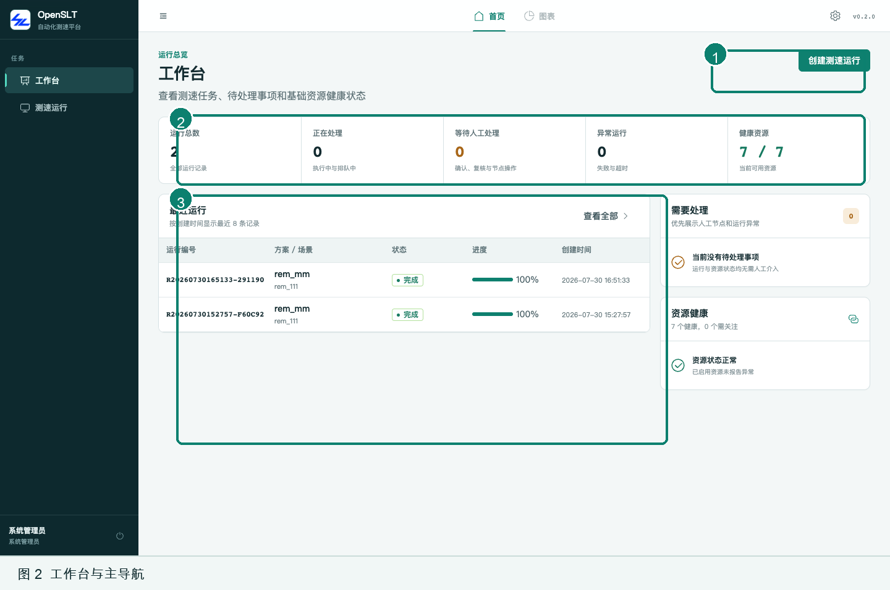
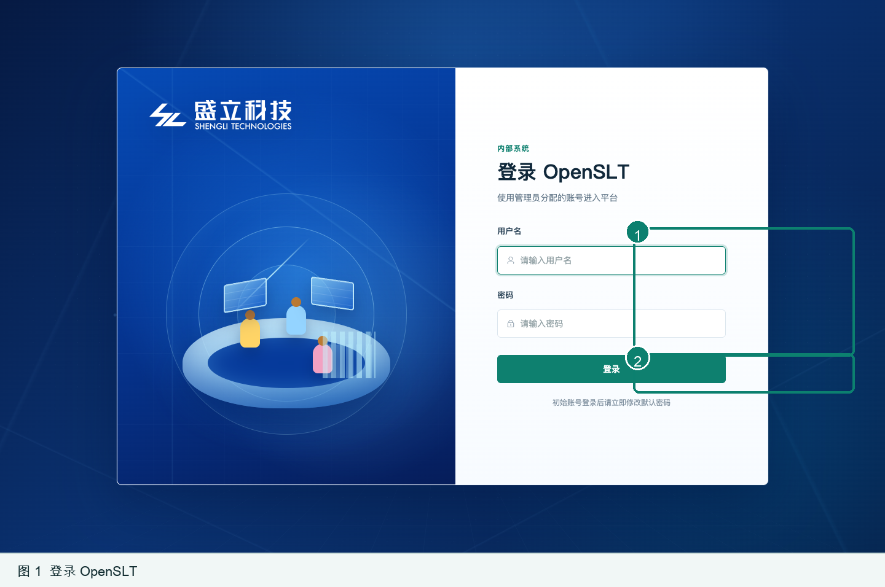
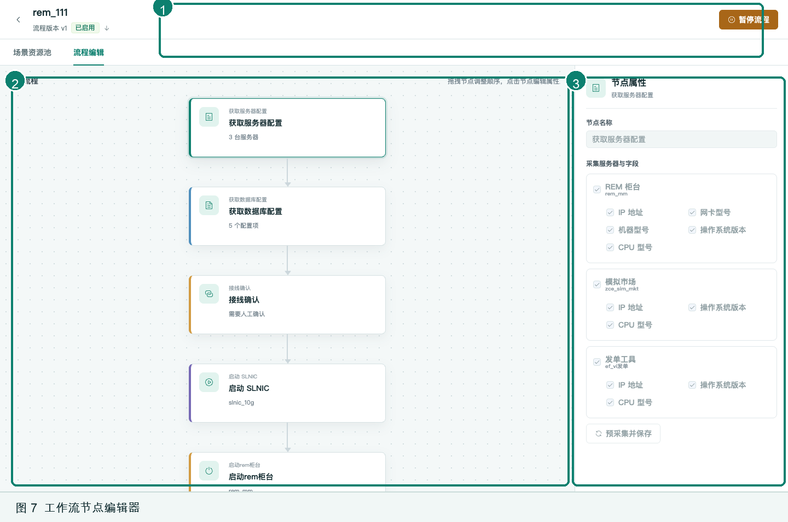
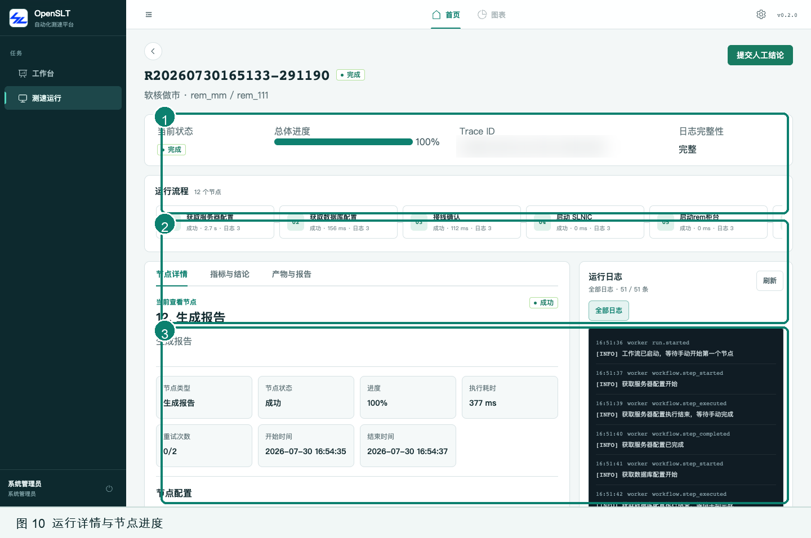
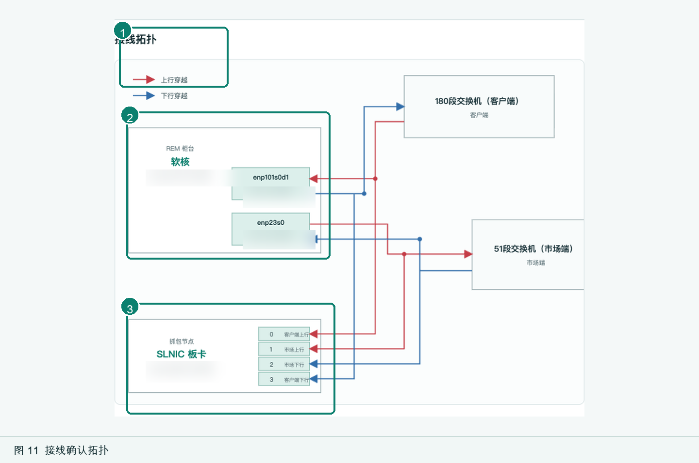

# OpenSLT 前端视觉圣经

> 当前实现基线：OpenSLT `0.2.2`，2026-09-03 代码状态  
> 适用范围：`frontend/src` 中的登录页、主应用框架、业务页面、工作流编辑器、运行详情、日志与终端界面  
> 本文描述现有视觉事实，并将重复出现的规律固化为后续设计与开发约束；不代表已经完成设计令牌重构。

## 1. 视觉定位

OpenSLT 是面向专业测试人员的自动化测试平台。它的视觉任务不是制造强烈情绪，而是让复杂的资源、流程、运行状态和诊断信息始终清晰、可信、可操作。

四个核心气质：

- **专业克制**：低饱和冷色为主，装饰让位于信息和操作。
- **精密可靠**：边界清楚、数字对齐、状态颜色稳定，形成仪器与控制台感。
- **高密度但不拥挤**：用分区、留白和层级组织复杂信息，而不是盲目放大组件。
- **平静可追溯**：正常流程保持安静，异常、等待和危险操作才提高视觉强度。

一句话定义：**冷静的测试控制台，而不是营销型 SaaS。**

## 2. 视觉世界

### 2.1 主工作区：冷静控制台

主应用使用深青黑侧栏、雾灰画布、白色面板和海松绿强调色。整体对比清晰但不刺眼，适合长时间阅读数据、配置流程和观察运行状态。



### 2.2 登录页：科技入口

登录页是独立的品牌场景：深蓝渐变、网格、雷达和操作台插画形成“进入测试中心”的仪式感；右侧表单仍回到白底、深色文字与绿色主操作，完成与主工作区的衔接。



两套场景允许差异化，但必须共享以下识别线索：清晰的中文无衬线字体、深色正文、绿色主操作、6–10px 的克制圆角、明确的输入焦点和状态反馈。

## 3. 设计原则

### 3.1 信息优先

- 页面首先回答“我在哪里、当前状态是什么、下一步能做什么”。
- 标题、状态、主要操作应在首屏建立稳定三角关系。
- 不为装饰牺牲表格列宽、日志可读性、表单标签或流程上下文。

### 3.2 颜色有含义

- 主绿色只用于主操作、选中态、当前态、可交互链接和正向强调。
- 红、橙、蓝必须承载危险、警告、信息等语义，不作为随机装饰。
- 大面积背景保持中性；高彩度色只占小面积。

### 3.3 结构胜于阴影

- 面板主要通过 1px 边框、留白和背景层次分组。
- 常规卡片几乎无阴影；抽屉、弹窗、浮层和悬浮节点才使用明显阴影。
- 同层级容器避免层层套卡片。

### 3.4 操作强度与视觉强度一致

- 页面级主操作使用实心主按钮。
- 次要操作使用默认按钮、文字按钮或链接按钮。
- 删除、终止、失败处理才使用危险色。
- 不可用状态降低对比，同时保留标签与原因。

### 3.5 动效只解释状态

- 动效用于悬停、按下、面板进出、进度变化和状态切换。
- 基准时长为 `160ms`，缓动为 `cubic-bezier(0.2, 0, 0, 1)`。
- 登录页雷达扫描是品牌性例外；业务页不使用持续装饰动画。

## 4. 色彩系统

### 4.1 核心令牌

以下变量定义于 `frontend/src/styles.css`，是当前实现的首选来源。

| 角色 | CSS 变量 | 色值 | 用途 |
|---|---|---:|---|
| 页面画布 | `--ui-canvas` | `#F3F7F7` | 页面底色、低层级空白区域 |
| 主表面 | `--ui-surface` | `#FFFFFF` | 卡片、表格、弹窗、表单 |
| 次表面 | `--ui-surface-subtle` | `#EAF1F2` | 筛选条、弱分组、摘要块 |
| 强次表面 | `--ui-surface-strong` | `#DDE8E9` | 更强的结构分隔 |
| 侧栏 | `--ui-sidebar` | `#0D292E` | 主导航背景 |
| 侧栏悬停 | `--ui-sidebar-hover` | `#16383E` | 导航悬停 |
| 侧栏选中 | `--ui-sidebar-active` | `#1D474A` | 当前导航 |
| 主色 | `--ui-primary` | `#0E806F` | 主按钮、链接、选中、焦点 |
| 主色悬停 | `--ui-primary-hover` | `#0B6B5E` | 主操作悬停、强调文字 |
| 主色浅底 | `--ui-primary-soft` | `#D9EFEA` | 选中背景、弱提示、标签 |
| 主文字 | `--ui-text-primary` | `#132B30` | 标题、正文重点、核心数值 |
| 次文字 | `--ui-text-secondary` | `#5C7075` | 正文说明、标签、辅助信息 |
| 弱文字 | `--ui-text-tertiary` | `#819196` | 元数据、占位信息、次级注释 |
| 默认边框 | `--ui-border` | `#D7E2E4` | 卡片、输入、表格分隔 |
| 强边框 | `--ui-border-strong` | `#B8C9CC` | 悬停、重要轮廓、结构线 |
| 成功 | `--ui-success` | `#187B61` | 完成、健康、通过 |
| 警告 | `--ui-warning` | `#A86618` | 等待、需人工处理、风险 |
| 危险 | `--ui-danger` | `#BD3F4B` | 失败、删除、阻断错误 |
| 信息 | `--ui-info` | `#356FA3` | 运行中、普通信息 |
| 终端 | `--ui-terminal` | `#101C24` | 日志、SQL、命令与终端背景 |

### 4.2 状态配色

| 状态 | 前景色 | 建议浅背景 | 使用方式 |
|---|---:|---:|---|
| 成功 / 健康 / 完成 | `#187B61` | `#DFF1EB` | 标签、圆点、图标、数值 |
| 运行中 / 信息 | `#356FA3` | `#E3EDF6` | 标签、流程步骤、提示 |
| 等待 / 警告 | `#A86618` | `#F8EAD5` | 待人工处理、非阻断风险 |
| 失败 / 危险 | `#BD3F4B` | `#F8E2E4` | 错误、删除、失败节点 |
| 默认 / 未开始 | `#5C7075` | `#EAF1F2` | 中性状态、禁用状态 |

状态不能只依赖颜色表达。现有实现以“颜色 + 文字 + 圆点或图标”组合为准，例如 `StatusBadge` 的状态点和文本标签。

### 4.3 专用配色

- **登录页背景**：`#061A43 → #0A3272 → #06204B` 深蓝渐变，局部叠加亮蓝径向光。
- **登录页品牌面板**：`#064BB6 → #053592 → #061D5A`。
- **终端与代码面板**：背景 `#101C24` 或 `#242632`，正文使用 `#D1DDE0`、`#D9E6DF` 一类冷白色。
- **接线拓扑**：上行链路 `#C43D47`，下行链路 `#326EAA`。这两个颜色只表示方向，不与业务成功/失败语义混用。
- **管理中心入口**：激活态使用橙色 `#CF6419` 与浅橙底 `#FFF0E5`，作为“进入配置域”的局部识别，不扩展为第二主色。

### 4.4 色彩禁忌

- 不在同一视图中引入新的品牌主色。
- 不用绿色表示纯装饰，也不用红色吸引无风险操作。
- 不用终端深色背景承载普通说明文字或大段业务表单。
- 新组件优先引用现有 `--ui-*` 变量；只有具有独立语义的专用图形才使用局部色值。

## 5. 字体与排版

### 5.1 字体族

**界面字体**

```css
font-family: "PingFang SC", "Microsoft YaHei", "Noto Sans CJK SC", system-ui, sans-serif;
```

用于导航、标题、正文、表单和按钮。中文环境优先使用系统原生字体，避免额外字体下载与内网部署风险。

**等宽字体**

```css
font-family: "Cascadia Code", "JetBrains Mono", Consolas, monospace;
```

用于运行编号、Trace ID、时间戳、IP、命令、日志、SQL、XML、指标数值和其他机器标识。全局启用 `tabular-nums`，让数字列稳定对齐。

### 5.2 字号层级

| 层级 | 字号 / 行高 | 字重 | 典型用途 |
|---|---|---:|---|
| 页面标题 | `26 / 36px` | 650 | 工作台、资源管理、日志中心 |
| 移动端页面标题 | `22 / 30px` | 650 | 767px 以下 |
| 详情主标题 | `23 / 1.18` | 650–700 | 当前运行节点、详情实体 |
| 弹窗 / 抽屉标题 | `17–21px` | 600–750 | 对话框、创建流程 |
| 区块标题 | `15–16px` | 600–650 | 面板标题、列表分区 |
| 正文 / 控件 | `13–14px` | 400–600 | 表单、主要内容、按钮 |
| 标签 / 表格 / 辅助正文 | `12px` | 500–650 | 高频主力字号 |
| 元数据 / 帮助 | `11px` | 400–650 | 时间、说明、计数、次信息 |
| 导航分组 / 微标签 | `10px` | 500–600 | Kicker、版本号、字段补充 |
| 核心指标 | `26–28px` | 650 | 总数、进度、关键数值 |

当前界面本身偏紧凑，`10px` 和 `11px` 仅用于辅助信息；关键操作、错误原因和需要阅读的正文不得降到 `11px` 以下。

### 5.3 排版规则

- 页面标题使用轻微负字距 `-0.025em`，大数字使用 `-0.04em`。
- 页面说明建议最大宽度 `65ch`，行高约 `1.6`。
- 机器标识单行省略；解释性文本允许换行并使用 `overflow-wrap: anywhere`。
- 表格数字、时间、编号保持等宽或表格数字样式。
- 中文标题不使用全大写；英文微标签可使用约 `0.1em` 的字距。

## 6. 空间、尺寸与形状

### 6.1 空间节奏

现有实现没有完整的 spacing token，但实际遵循约 4px 基础节奏。优先使用：

| 尺度 | 用途 |
|---:|---|
| `4px` | 图标与微文案、紧凑内部间隔 |
| `8px` | 同组操作、标签、紧凑卡片内部间隔 |
| `12px` | 表单字段、列表项、筛选控件间隔 |
| `16px` | 面板间距、常规卡片内边距 |
| `20px` | 页面区块、弹窗主体、复杂卡片内边距 |
| `24px` | 页面主要区块与宽松表单间距 |
| `28–32px` | 桌面页面水平留白 |
| `36–40px` | 页面底部与大段落收尾留白 |

相邻关系越紧密，间距越小；禁止用多个空行或随意 margin 制造层级。

### 6.2 圆角

| 令牌 / 数值 | 用途 |
|---|---|
| `--ui-radius-control: 6px` | 按钮、输入框、下拉框 |
| `7–8px` | 筛选条内部块、小卡片、提示条 |
| `--ui-radius-panel: 10px` | 主卡片、面板、指标组 |
| `--ui-radius-dialog: 12px` | 弹窗 |
| `50%` | 状态点、头像式标记、圆形按钮 |

圆角应体现层级：控件小、面板中、弹窗大。不要在普通后台卡片上使用夸张胶囊形状。

### 6.3 边框与阴影

- 默认容器：`1px solid var(--ui-border)`。
- 悬停或选中：提升到 `--ui-border-strong` 或 `--ui-primary`。
- 普通卡片阴影：`0 1px 2px rgba(19, 43, 48, 0.025)`，近乎无感。
- 弹层阴影：`0 10px 30px rgba(19, 43, 48, 0.1)`。
- 工作流节点：允许 `0 7px 20px rgba(35, 58, 68, 0.07)`，选中时叠加绿色焦点环。
- 登录卡片是品牌例外，可使用更深、更大的蓝黑阴影。

## 7. 应用框架

### 7.1 桌面布局

- 侧栏宽 `224px`，折叠后 `64px`，固定占满 `100dvh`。
- 顶栏高 `52px`，白色半透明背景，`12px` 模糊，滚动时保持粘性。
- 内容区最大宽 `1600px`，桌面内边距 `28px 32px 40px`。
- 顶栏采用三列布局：导航开关 / 居中页域导航 / 管理入口与版本号。

### 7.2 导航

- 侧栏导航项高 `42px`，圆角 `6px`，图标 `17px`。
- 当前项使用深青高亮底，并在左侧显示 `3px` 薄荷绿标记。
- 分组标题使用 `10px`、较大字距和低对比青灰色。
- 侧栏底部固定显示当前用户与退出操作。
- “首页”与“管理中心”是两个页面域：管理中心允许使用局部橙色激活态，但侧栏交互仍保持绿色体系。

### 7.3 页面头部

标准顺序为：

1. `page-kicker`：12px 绿色领域标签；
2. `page-title`：26px 页面名称；
3. `muted`：一句话说明当前页面任务；
4. 右侧主操作：创建、提交、刷新等。

页面头部下方才进入指标、筛选、表格或工作区，不在标题旁堆积低频操作。

## 8. 核心组件规范

### 8.1 按钮

| 类型 | 视觉 | 使用场景 |
|---|---|---|
| Primary | 绿色实心、白字 | 每个操作域唯一主动作 |
| Default | 白底、灰边、深色文字 | 取消、返回、刷新、辅助动作 |
| Text / Link | 无容器或弱容器 | 表格行操作、低频工具 |
| Danger | 红色文字或红色强调 | 删除、终止、不可逆操作 |
| Circle icon | 32–36px | 顶栏、紧凑工具栏 |

默认按钮最小高度 `36px`。按下态下移 `1px`；键盘焦点使用绿色描边或 `--ui-focus`，不能只改变颜色。

### 8.2 表单控件

- 控件圆角 `6px`，标准高度约 `36px`；登录输入与关键选择器可提高到 `42–46px`。
- 标签使用 `12–14px` 深色文字，字段说明使用 `11–12px` 次文字。
- 聚焦态：绿色内描边加浅绿色外环。
- 错误态紧邻字段，使用危险色文字；服务端错误可使用浅红提示块。
- 创建运行、方案和场景等长表单放入抽屉或弹窗，底部操作区保持粘性。
- 必填项使用文字标签后的红色 `*`，不依赖 placeholder 表示字段含义。

### 8.3 筛选条

- 使用次表面底色、1px 边框、`8px` 圆角和 `12px` 内边距。
- 控件水平排列并保持 `10px` 间隔；结果计数和“重置”靠右。
- 搜索框通常宽 `280–360px`，分类筛选约 `145–160px`。
- 小屏下所有筛选器堆叠为满宽，不保留狭窄多列。

### 8.4 表格

- 表头高 `40px`，背景 `#EEF4F4`，文字 `12px / 600`。
- 数据行高至少 `44px`，悬停背景 `#F1F7F6`。
- 时间和机器标识使用 `10–12px` 等宽或数字等宽样式。
- 行内主要操作用绿色链接，删除用红色；高频列表避免每行出现多个实心按钮。
- 可点击行使用指针光标；隐藏的复制等快捷操作在悬停或键盘聚焦时出现，移动端必须常显。

### 8.5 卡片与面板

- `.panel` 用于结构分区；`.card` 可带极浅阴影。
- 面板标题区通常为 `16–18px` 内边距，并用底边框与主体分隔。
- 小型信息卡使用 `8px` 圆角、渐变或次表面背景；悬停最多上移 `1px`。
- 指标组用 1px 网格缝隙连接为整体，避免一排悬浮孤岛卡片。

### 8.6 标签、状态与进度

- 标签圆角 `4px`，字重 500–600，颜色按状态语义映射。
- `StatusBadge` 使用 `5px` 圆点加文字；列表中不得只显示彩色圆点。
- 进度条轨道使用冷灰，填充使用主绿色；百分比与条形同时存在。
- “当前”“选中”“健康”和“已完成”虽然都可使用绿色，但文案必须明确对象。

### 8.7 Tabs、折叠与版本列表

- Tabs 高 `44–48px`，当前项绿色并提高字重。
- 版本、方案等折叠项使用整行点击区域、清晰箭头变化和底部分隔。
- 收起状态仍保留标题、状态与关键元数据。

### 8.8 弹窗、抽屉与遮罩

- 弹窗圆角 `12px`；抽屉保持直角外边缘和清晰分区。
- Header、Body、Footer 通过边框分隔，主体通常为 `20px` 内边距。
- 遮罩为 `rgba(5, 25, 29, 0.46)` 并带 `2px` 模糊。
- 页面级创建流程优先用右侧抽屉；需要聚焦确认的小任务使用居中弹窗。
- 主操作位于右下，取消操作在其左侧；长内容中 Footer 保持可见。

### 8.9 空、错、载入状态

- 空状态最小高度约 `180–220px`，使用标题 + 简短说明 + 可选动作。
- 错误信息在发生位置就近出现；页面加载失败使用 Alert 并提供重试。
- 无数据不是错误，不使用红色。
- 骨架、Spinner 或按钮 loading 只覆盖正在变化的区域，不冻结无关页面。

## 9. 专业数据组件

### 9.1 工作流编辑器

工作流编辑器是独立的全屏工作区，不套用主侧栏。顶部为 72px 流程头部，下方是 48px 页签，主体由流程画布与属性面板组成。



- 画布使用 `#F4F8F8` 和 22px 点阵，表达可编辑空间。
- 节点宽约 `360px`，在紧凑屏幕缩至 `290–330px`；白底、左侧 4px 类型色条、10px 圆角。
- 默认节点色为青绿；蓝、琥珀、玫红、紫色只区分节点类型或性质。
- 选中态使用主绿色边框与浅绿色焦点环；悬停只上移 `1px`。
- 流程方向由居中的连线和箭头表达，新增点放在线路中，不与节点主内容抢层级。
- 1023px 以下属性面板变为右侧滑层；767px 以下仍保持画布可用宽度和节点可读性。

### 9.2 运行详情

运行详情遵循“全局状态 → 流程定位 → 当前节点 → 日志证据”的阅读顺序。



- 顶部摘要在桌面端为四列，在 1023px 以下变两列，767px 以下单列。
- 流程步骤使用横向滚动条带，当前、成功、失败、运行中、等待均有文字和颜色。
- 主工作台桌面端为内容 + `380px` 日志栏；1023px 以下改为单列。
- 节点详情用 68px 以上的信息块展示类型、状态、进度、耗时和时间。
- 日志栏深色、粘性定位，作为证据层而非主视觉层。

### 9.3 日志、终端与代码

- 日志、SQL、命令、XML 和 SSH 终端统一使用深色表面与等宽字体。
- 正文约 `11–13px / 1.6–1.7`；时间、来源和事件名使用更低对比色。
- 错误行可使用浅红文字，但不改变整个终端背景。
- 长内容必须可滚动并支持换行或横向滚动，不能裁掉完整命令或 Trace ID。
- SSH 终端可使用青色光标、绿/青/黄 ANSI 色；高饱和颜色只用于终端语义。

### 9.4 接线拓扑



- 设备和交换机使用白色或浅灰外壳，1–1.5px 冷灰描边。
- 上行固定为红色，下行固定为蓝色，图例必须同时出现。
- 端口与接口使用浅青块，名称与 IP 保持高可读对比。
- 图形最小宽度约 `720–760px`，窄屏通过横向滚动保留拓扑结构，不压缩到不可读。

## 10. 页面模式

| 页面类型 | 结构 | 视觉重点 |
|---|---|---|
| 登录 | 品牌面板 + 表单面板 | 品牌入口、明确焦点、单一主动作 |
| 工作台 | 指标条 + 近期运行 + 待处理/健康侧栏 | 状态概览与下一步 |
| 资源 / 运行 / 日志列表 | 页面头 + 筛选条 + 表格 | 扫描效率与批量定位 |
| 方案与场景 | 目录栏 + 方案卡 + 场景表 | 层级关系与配置入口 |
| 创建 / 编辑 | 抽屉或弹窗 + 分组表单 + 固定 Footer | 连续填写与安全提交 |
| 工作流 | 全屏画布 + 属性面板 | 顺序、节点类型、选中上下文 |
| 运行详情 | 摘要 + 流程条 + 节点详情 + 日志 | 运行定位与证据链 |
| 数据库 / 终端 | 工具栏 + 深色编辑区或终端 | 专业工具感与内容完整性 |

## 11. 响应式规则

### 11.1 断点

现有实现的主断点：

| 断点 | 行为 |
|---:|---|
| `≤1250px` | 压缩复杂工作台、日志栏和工作流节点宽度 |
| `≤1199px` | 页面水平内边距由 32px 降为 24px；侧栏进入紧凑模式 |
| `≤1023px` | 双栏详情改为单栏；工作流属性面板改为滑层 |
| `≤900/980px` | 两列表单或设置页改为单列 |
| `≤767px` | 移动端主断点：侧栏变抽屉、页面 16px 边距、筛选器满宽、弹窗适配视口 |
| `≤599/640px` | 复杂表单、卡片和详情元数据进一步单列 |
| `≤420/480px` | 登录卡片贴边、版本列表等紧凑适配 |

### 11.2 响应式原则

- 优先重排，不缩小到不可读。
- 表格和拓扑允许横向滚动；表单和卡片优先改为单列。
- 侧栏在 767px 以下变为覆盖式抽屉，并提供遮罩和关闭操作。
- 移动端保留主要操作，悬停才能出现的动作必须常显。
- 弹窗宽度为 `calc(100vw - 24px)`，高度不超过视口并让 Body 独立滚动。
- 终端高度使用 `dvh`，避免移动浏览器工具栏造成遮挡。

## 12. 图标、品牌资产与插画

- 通用图标来自 `@element-plus/icons-vue`，保持线性、简洁和约 `14–19px` 的尺寸范围。
- 图标通常与文字共同出现；单独图标按钮必须提供 Tooltip 和 `aria-label`。
- 主框架品牌图标使用 `/assets/global.logo.jpg`，显示在 34×34px 容器内。
- 登录页品牌 Logo 使用 `/assets/atl.site.logo.png`，桌面最大约 231px 宽。
- 登录插画由 CSS 图形组成，使用网格、雷达、屏幕和操作员抽象形态；业务页面不复制这一装饰语言。
- 不混用填充风格、拟物风格和线性图标；新增图标优先从现有 Element Plus 图标集中选择。

## 13. 可访问性底线

- 所有键盘可操作元素必须有可见 `:focus-visible` 状态。
- 页面提供“跳到主要内容”链接，主内容可聚焦。
- 图标按钮必须有可访问名称；纯装饰图形使用 `aria-hidden` 或空 `alt`。
- 状态使用文字补充颜色；错误与字段建立就近关系。
- 正文、按钮、输入标签保持足够对比；弱文字不承载关键决策信息。
- 支持 `prefers-reduced-motion: reduce`：取消平滑滚动，将动画和过渡压缩到近乎即时。
- 触屏环境不依赖 hover 才能完成操作。

## 14. 动效与交互反馈

| 场景 | 当前动作 |
|---|---|
| 按钮按下 | `translateY(1px)` |
| 卡片 / 节点悬停 | 边框增强，最多上移 `1px` |
| 选中节点 | 绿色边框 + 浅绿色 3px 光环 |
| 导航激活 | 左侧标记由缩短变为完整高度 |
| 进度变化 | `220ms` 平滑宽度变化 |
| 侧栏 / 属性面板 | `160ms` 位移过渡 |
| 登录雷达 | `5.8s` 线性循环旋转 |

不要添加弹跳、弹簧、视差或大面积渐变位移动画。OpenSLT 的反馈应像仪器响应：短、准、可预测。

## 15. 文案与数据呈现

- 页面 Kicker 用领域词：如“运行总览”“基础设施”“可观测性”。
- 标题使用任务对象：如“工作台”“资源管理”“日志中心”。
- 说明句描述用户能做什么，不重复标题。
- 按钮使用动词 + 对象：如“创建测速运行”“新增资源”“提交人工结论”。
- 状态文案保持稳定：完成、运行中、等待、失败、已启用、已暂停等不随页面变化。
- 空状态先描述事实，再给下一步；错误文案说明失败对象和恢复动作。
- 技术标识保留原始大小写与格式，不翻译 Trace ID、SQL、WebSocket、SLA、IP 等术语。

## 16. 设计与开发检查表

新增或修改界面前，逐项确认：

- [ ] 是否沿用“雾灰画布 + 白色表面 + 深青文字 + 海松绿主色”？
- [ ] 是否复用了现有 `--ui-*` 或 Element Plus 变量，而非新增近似色？
- [ ] 是否只有一个最强主操作？危险操作是否准确使用红色？
- [ ] 页面标题、说明、主操作和内容首区是否形成清晰顺序？
- [ ] 数字、时间、命令和机器标识是否使用等宽或表格数字？
- [ ] 状态是否同时提供文字与颜色/图标？
- [ ] 普通容器是否优先使用边框而非重阴影？
- [ ] 复杂内容在 1023px、767px 和小屏下是否仍可完成任务？
- [ ] 移动端是否不依赖 hover？
- [ ] 键盘焦点、错误提示、空状态、载入状态是否完整？
- [ ] 是否支持 reduced motion？
- [ ] 是否避免把登录页的装饰性蓝色科技视觉带入业务数据页？

## 17. 实现约束与演进边界

### 17.1 当前事实

- 全局核心色、圆角、阴影、焦点和过渡已经令牌化，并同步覆盖 Element Plus。
- 组件内仍存在较多局部硬编码色值，尤其是工作流节点、登录插画、终端和状态浅背景。
- 间距与字号已形成稳定尺度，但尚未定义为完整 CSS token。
- 当前仅实现浅色主工作区；深色仅用于侧栏、终端与登录品牌场景。

### 17.2 后续新增界面的最小规则

```css
.new-panel {
  padding: 16px;
  border: 1px solid var(--ui-border);
  border-radius: var(--ui-radius-panel);
  background: var(--ui-surface);
}

.new-panel__title {
  color: var(--ui-text-primary);
  font-size: 15px;
  font-weight: 600;
}

.new-panel__meta {
  color: var(--ui-text-secondary);
  font-size: 11px;
}
```

新增组件先复用现有变量和 Element Plus 能力。只有当同一视觉值在多个独立组件中重复且语义稳定时，才新增令牌；不要为单一页面创建抽象层。

## 18. 视觉基准索引

| 基准 | 文件 |
|---|---|
| 全局令牌与 Element Plus 覆盖 | `frontend/src/styles.css` |
| 主框架与响应式导航 | `frontend/src/layouts/ShellLayout.vue` |
| 登录品牌场景 | `frontend/src/views/LoginView.vue` |
| 工作流画布与节点 | `frontend/src/views/WorkflowEditorView.vue` |
| 运行详情体系 | `frontend/src/styles/run-detail.css` |
| 状态标签 | `frontend/src/components/StatusBadge.vue` |
| SSH 终端 | `frontend/src/components/SshTerminalPanel.vue` |
| 接线拓扑 | `frontend/src/components/WiringTopologyDiagram.vue` |
| 当前页面截图 | `docs/output/screenshots/user-guide/` |

---

**最终判断标准：** 如果一个新界面看起来像同一套冷静、精密、可长期使用的测试控制台，并且用户能在几秒内辨认层级、状态和下一步操作，它就符合 OpenSLT 的视觉语言。
