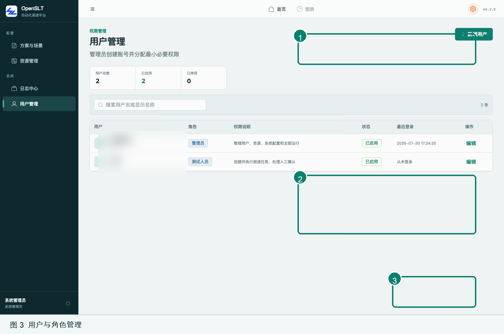
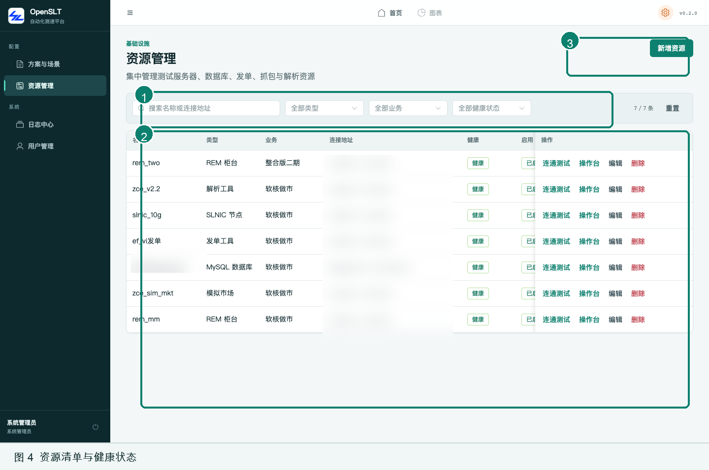
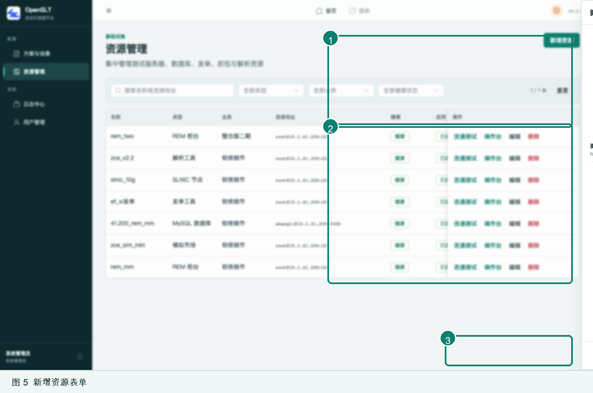
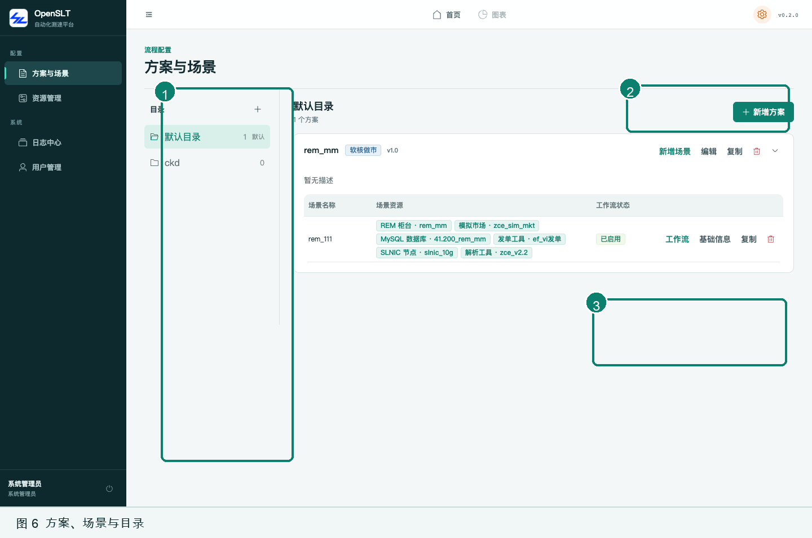
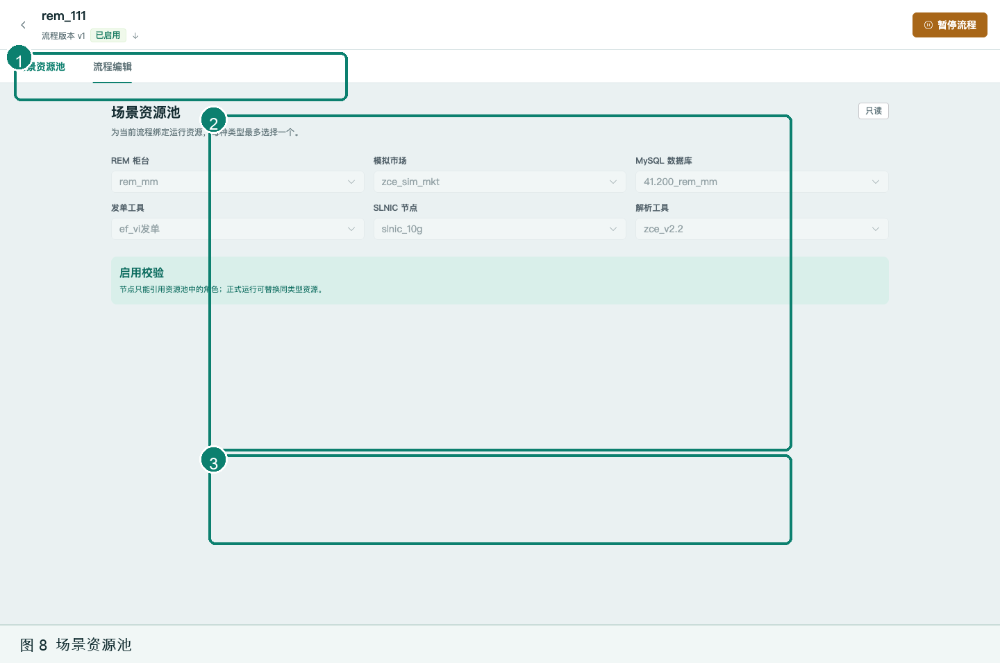
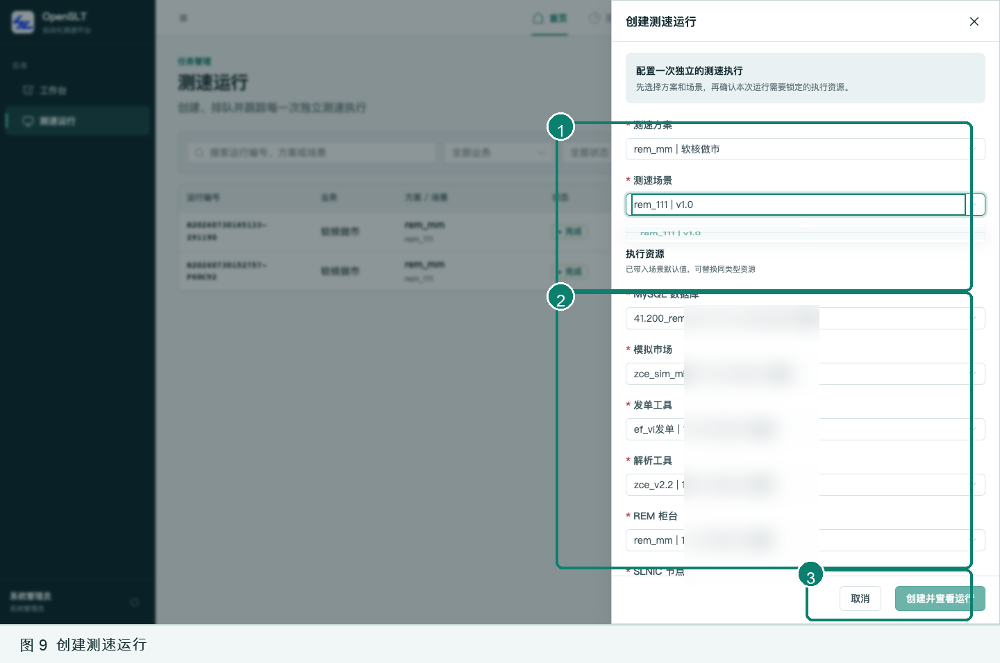
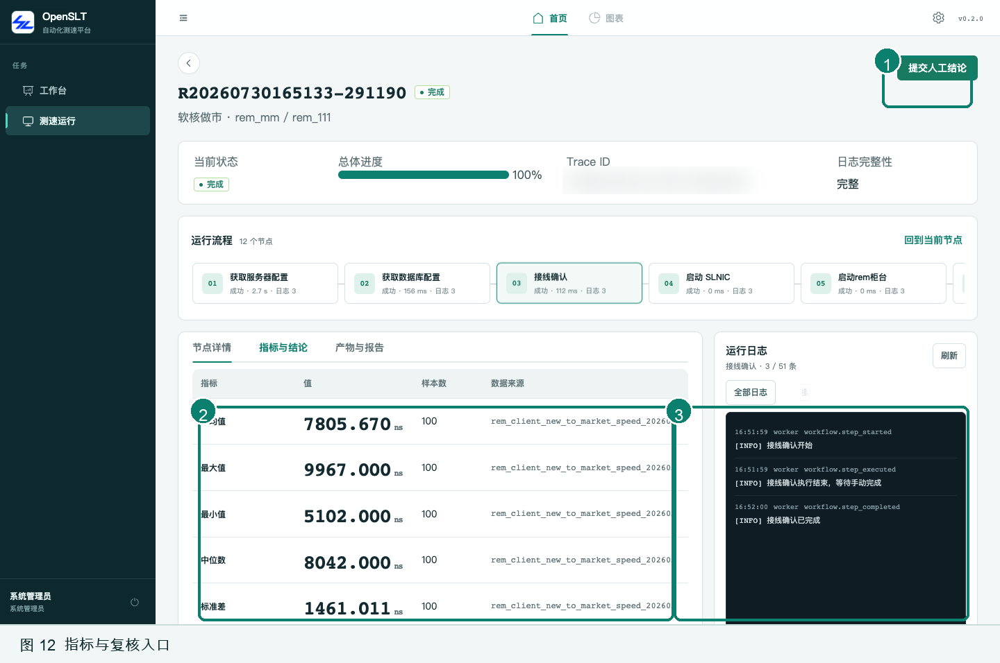
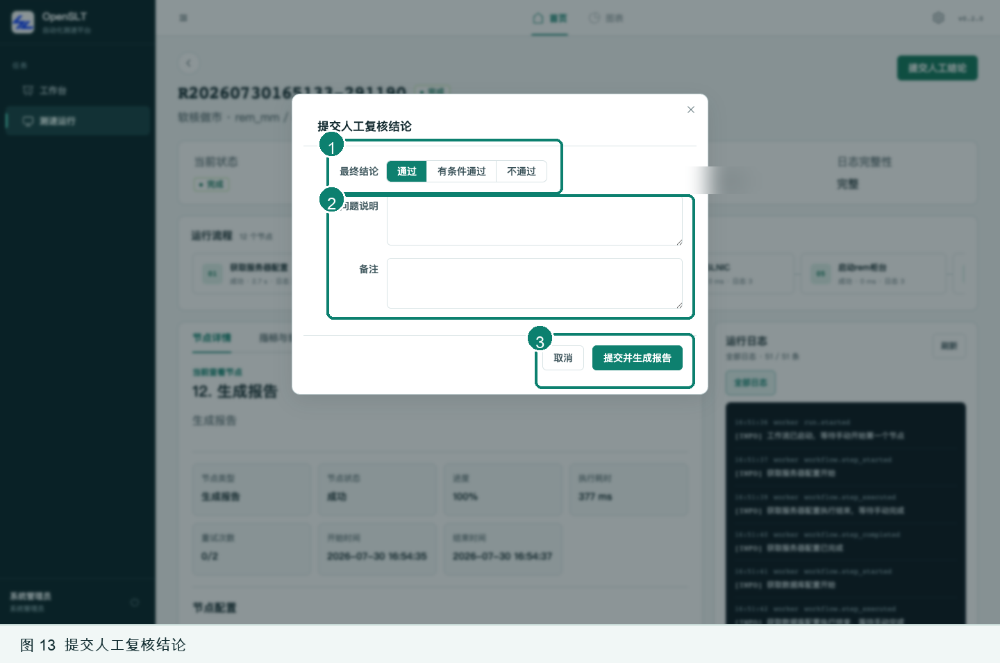
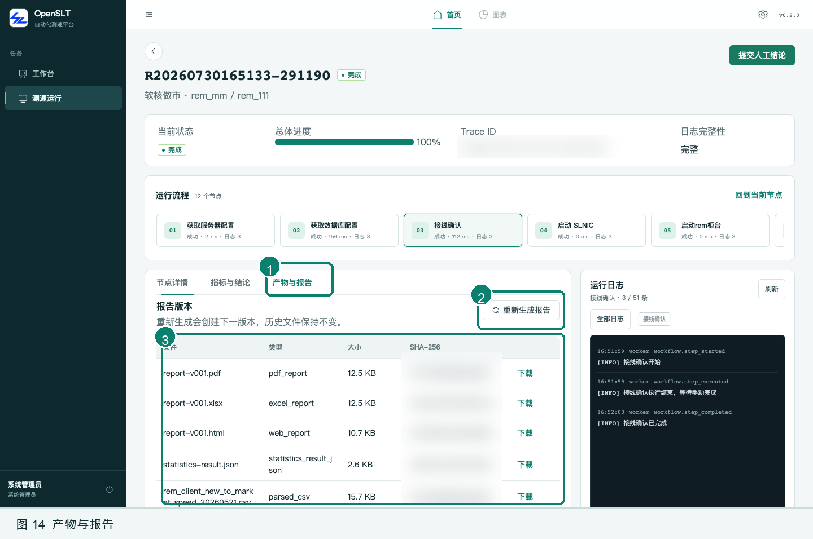
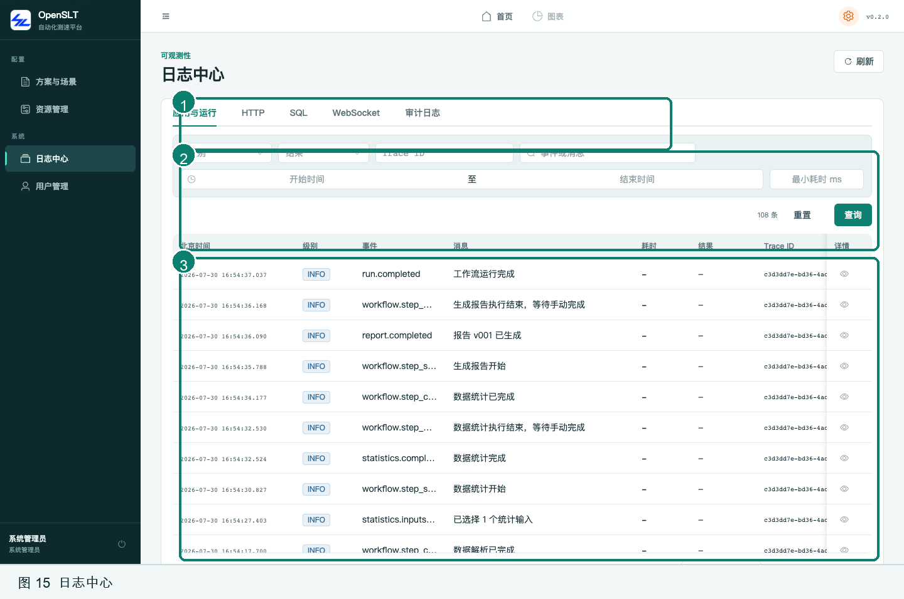

# OpenSLT 自动化测试平台主流程使用说明书

| 文档属性 | 内容 |
| --- | --- |
| 适用系统 | OpenSLT 自动化测试平台 |
| 系统版本 | 0.2.0 |
| 文档版本 | 1.0 |
| 编制日期 | 2026-07-30 |
| 适用读者 | 系统管理员、测试人员 |

> 本文截图来自当前测试环境。主机地址、登录账号、Trace ID、文件校验值等环境信息已经脱敏，界面中的方案、场景和运行数据仅用于说明操作方法。

## 目录

1. [系统概述](#1-系统概述)
2. [登录与界面导航](#2-登录与界面导航)
3. [管理员初始化](#3-管理员初始化)
4. [配置方案、场景与工作流](#4-配置方案场景与工作流)
5. [创建测速运行](#5-创建测速运行)
6. [执行和跟踪测速流程](#6-执行和跟踪测速流程)
7. [结果复核与报告归档](#7-结果复核与报告归档)
8. [日志、终端与数据库辅助工具](#8-日志终端与数据库辅助工具)
9. [常见问题与处理建议](#9-常见问题与处理建议)
10. [附录：检查清单与术语](#10-附录检查清单与术语)

---

## 1. 系统概述

OpenSLT 面向盛立 REM 期货测速工作，将测试资源、方案、场景、执行步骤、日志、统计结果和报告集中管理。系统支持软核做市、整合版二期、整合版二期做市等业务类型，可连接 REM、模拟市场、发单工具、SLNIC、解析机和业务数据库。

### 1.1 角色与权限

| 角色 | 主要职责 | 典型权限 |
| --- | --- | --- |
| 管理员 | 平台初始化和日常管理 | 管理用户、资源、凭据、日志和全部测速流程 |
| 测试人员 | 配置并执行测速任务 | 维护方案和工作流、创建运行、处理人工节点、复核结果 |
| 访客 | 查看结果 | 只读查看资源、方案、运行、指标和报告 |

管理员和测试人员在执行测速前应确认自己的 Web 角色与远端服务器权限匹配。Web 角色不会自动授予 SSH、MySQL 或目标程序权限。

### 1.2 主流程

```text
管理员准备账号与资源
        ↓
测试人员创建方案和场景
        ↓
绑定资源、配置节点并启用工作流
        ↓
创建运行并锁定本次执行资源
        ↓
预检 → 接线确认 → 启动环境 → 发单 → 抓包 → 解析 → 统计
        ↓
人工复核 → 生成报告 → 下载归档
```

同一资源不会同时被多个运行占用。运行创建后保存方案、场景、工作流和资源快照，后续修改配置不会改变已有运行的历史内容。

### 1.3 使用前准备

开始操作前确认以下条件：

- 浏览器可以访问 OpenSLT 地址，建议使用当前版本的 Chrome 或 Edge。
- 已取得管理员分配的账号，初始密码已按安全要求修改。
- 测试所需服务器、数据库和工具已录入且处于“健康、已启用”状态。
- 远端程序、脚本、XML 配置和数据库表已按业务要求准备。
- 线缆、交换机端口和 SLNIC 板卡具备本次测试条件。

---

## 2. 登录与界面导航

### 2.1 登录系统

1. 在浏览器中打开 OpenSLT 地址。
2. 输入管理员分配的用户名和密码。
3. 单击“登录”。
4. 首次使用初始账号时，立即联系管理员完成密码修改或重置，不得长期使用部署初始密码。


图 1 标注说明：

1. 输入用户名和密码，密码框默认隐藏明文。
2. 单击“登录”进入工作台；连续失败时先确认账号状态和密码，不要反复尝试未知密码。

### 2.2 工作台和导航

登录后默认进入“工作台”。左侧菜单会随当前区域变化：

- “首页”区域先显示工作台，工作台下方的“测速”分组包含测速运行。
- 右上角“管理中心”进入方案、资源、日志和用户管理。
- 版本号入口用于查看当前版本和更新说明。
- 左下角显示当前用户及角色，旁边按钮用于退出登录。


图 2 标注说明：

1. 测试人员可从工作台直接创建测速运行。
2. 概览区显示运行总数、处理中、待人工处理、异常运行和健康资源。
3. “最近运行”用于快速进入运行详情；右侧“需要处理”优先列出人工节点和异常任务。

> 操作建议：每次开始测试先查看“等待人工处理”“异常运行”和“健康资源”，避免在已有异常未处理时继续创建任务。

---

## 3. 管理员初始化

管理员通常只在首次上线、人员变更或测试环境调整时执行本章操作。日常测速从第 4 章开始。

### 3.1 创建和维护用户

进入“管理中心 → 用户管理”，单击“新增用户”。



图 3 标注说明：

1. 填写唯一用户名、显示名称和不少于 8 个字符的初始密码。
2. 按最小权限原则选择管理员、测试人员或访客角色。
3. 单击“保存用户”；只打开本表单不会创建账号。

管理员还可以在用户列表中单击“编辑”，修改显示名称、角色、账号状态或重置密码。停用账号后，该账号不能继续登录；不要通过共享管理员账号代替正常的人员账号管理。

### 3.2 资源类型

一个完整的软核做市场景通常使用以下资源：

| 资源类型 | 用途 | 关键检查项 |
| --- | --- | --- |
| REM 柜台 | 被测柜台程序 | SSH、交易/查询地址、远端目录、启动命令 |
| 模拟市场 | 提供行情和交易对端 | SSH、脚本、市场端网卡 |
| MySQL 数据库 | 配置采集和解析输入 | 直连或 SSH 隧道、数据库列表、查询权限 |
| 发单工具 | 执行报单和报价动作 | SSH、程序目录、XML 配置、tmux 环境 |
| SLNIC 节点 | 抓包、停止抓包和合并 pcapng | SSH、板卡端口、抓包命令、产物目录 |
| 解析工具 | 解析抓包和统计输入 | SSH、解析 XML、脚本、输出目录 |

### 3.3 检查资源清单

进入“管理中心 → 资源管理”。



图 4 标注说明：

1. 可按名称、类型、业务和健康状态筛选资源。
2. 列表展示资源类型、业务、健康状态、启用状态和操作入口；连接地址已在截图中脱敏。
3. 仅管理员可以新增资源。

资源行常用操作：

- “连通测试”：使用已保存的凭据检查连接并更新健康状态。
- “操作台”：SSH 资源进入终端，数据库资源进入数据库控制台。
- “编辑”：更新连接信息、凭据、路径和业务参数。
- “删除”：仅删除不再使用且没有受保护引用的资源；优先使用停用保留历史关系。

### 3.4 新增资源

单击“新增资源”，先选择资源类型，再填写对应字段。



图 5 标注说明：

1. 填写资源名称、类型、所属业务和启用状态。
2. 配置 SSH 地址、端口、用户名和认证方式；不同资源类型会显示不同的扩展字段。
3. 保存前执行“连通测试”，确认网络、凭据和目标服务均可用。

注意事项：

- 资源名称应能区分业务、用途和环境，不要只使用 IP 地址命名。
- 密码和私钥由系统加密保存，编辑时留空表示保留原凭据。
- REM 的交易、查询地址和端口必须完整，否则接线拓扑与运行预检会失败。
- 数据库资源应选择本平台需要访问的业务库，并使用最小权限账号。
- 资源类型和所属业务保存后会影响场景可选范围，修改前确认没有运行依赖。

---

## 4. 配置方案、场景与工作流

### 4.1 创建目录、方案和场景

进入“管理中心 → 方案与场景”。配置顺序为“目录 → 方案 → 场景 → 工作流”。



图 6 标注说明：

1. 目录用于对方案做一级分类；默认目录不能删除。
2. 单击“新增方案”，填写名称、业务、配置版本、描述和启用状态。
3. 在方案下新增场景并绑定资源；单击“工作流”进入节点配置。

方案和场景配置要求：

- 方案业务必须与后续选择的资源业务一致。
- 一个场景中同一种资源类型最多选择一个资源。
- 场景初次创建后为未启用状态，必须完成工作流配置和启用。
- “复制”可复用已有方案或场景；副本默认不可直接运行，应复核资源和节点后再启用。
- 已有运行历史的方案不能直接删除，应停用并保留审计链路。

### 4.2 配置工作流节点

工作流页面包含“场景资源池”和“流程编辑”两个页签。已启用版本为只读；如需修改，先单击“暂停流程”，完成编辑后重新启用。


图 7 标注说明：

1. 顶部显示当前流程版本和状态；版本菜单可查看、新增和归档历史版本。
2. 主流程按执行顺序展示节点，拖拽可调整顺序，单击节点可查看或编辑属性。
3. 右侧为当前节点属性；处于编辑状态时应保存节点修改并处理未保存提示。

典型主流程节点如下：

| 顺序 | 节点 | 主要动作 |
| --- | --- | --- |
| 1-2 | 获取服务器/数据库配置 | 保存运行前配置快照 |
| 3 | 接线确认 | 根据动态拓扑人工核对线缆和网卡 |
| 4-6 | 启动 SLNIC、REM、模拟市场 | 通过终端下发命令并人工确认 |
| 7 | 发单执行 | 启动发单工具并发送配置允许的动作 |
| 8-9 | 关闭 SLNIC、合并 pcapng | 停止抓包并生成合并包 |
| 10 | 数据解析 | 获取数据库 CSV 并执行解析 |
| 11 | 数据统计 | 选择最近一次解析结果并生成指标 |
| 12 | 生成报告 | 生成 HTML、Excel 和 PDF 报告 |

编辑节点时遵循以下原则：

- 节点引用的资源必须存在于场景资源池。
- 预览或预采集成功不等于正式运行成功，还要检查远端程序状态。
- 命令、脚本、XML 和数据库配置项允许先保存草稿，但启用前会执行完整校验。
- 手工节点应写清完成条件，避免不同操作员采用不同判断标准。

### 4.3 绑定场景资源池



图 8 标注说明：

1. 在“场景资源池”和“流程编辑”之间切换。
2. 每种资源类型最多绑定一个默认资源；正式运行时可替换为同业务、同类型资源。
3. 启用校验保证节点只能引用资源池中的角色。

资源和节点分别保存。修改资源池后应重新检查依赖这些资源的节点，再执行启用。启用成功后，场景才会出现在“创建测速运行”的可选列表中。

### 4.4 版本和启用规则

- “暂停流程”：停止新运行使用当前版本，并允许继续编辑同一可见版本。
- “重新启用”：校验当前节点与资源配置，通过后恢复可运行状态。
- “新增版本”：从当前或选定历史版本复制，形成新的可编辑版本。
- “归档版本”：隐藏不再使用的历史版本；已有运行仍保留原版本快照。
- 切换或离开存在未保存修改的页面时，按系统提示决定保存或放弃。

---

## 5. 创建测速运行

在工作台单击“创建测速运行”，或进入“测速运行”页面单击“创建运行”。



图 9 标注说明：

1. 选择已启用的测速方案和场景。
2. 核对本次运行的执行资源。系统会带入场景默认值，可替换同业务、同类型、已启用资源；地址已脱敏。
3. 确认资源数量完整后，单击“创建并查看运行”。

创建按钮不可用时依次检查：

1. 方案是否启用。
2. 场景是否已启用且存在已发布工作流。
3. 所有必需资源类型是否已选择。
4. 资源是否与方案属于同一业务。
5. 每种资源类型是否只选择一个资源。
6. 资源是否已启用且未处于异常状态。

创建运行只生成任务和配置快照，不会立即执行远端命令。进入运行详情后还需单击“启动运行”。运行启动后，系统先排队获取资源锁，再执行环境预检。

---

## 6. 执行和跟踪测速流程

### 6.1 运行详情


图 10 标注说明：

1. 摘要区显示状态、总体进度、Trace ID 和日志完整性；Trace ID 已脱敏。
2. 节点条按顺序显示状态、耗时和日志数，可横向滚动并单击任一节点。
3. 下方工作区同时显示节点详情与运行日志，便于核对输入、结果和错误。

新建运行的基本操作顺序：

1. 单击“启动运行”。
2. 等待“资源排队”和“环境预检”完成。
3. 系统进入“等待节点开始”后，检查当前节点配置并单击“开始”。
4. 自动执行节点结束后，根据界面提示单击“完成”或执行专用确认动作。
5. 重复处理后续人工节点，直至统计和报告生成完成。

### 6.2 常见运行状态

| 状态 | 含义 | 操作建议 |
| --- | --- | --- |
| 草稿 | 已创建但未启动 | 核对资源后启动或删除 |
| 资源排队 | 正在等待资源锁 | 检查是否有其他运行占用同一资源 |
| 环境预检 | 正在检查连接和配置 | 等待完成，失败时查看错误与日志 |
| 等待节点开始 | 当前节点需要人工启动 | 核对现场条件后单击“开始” |
| 等待节点完成 | 自动动作结束，等待人工确认 | 检查终端、产物或现场状态后单击“完成” |
| 等待节点重试 | 当前节点执行失败 | 处理根因后重试，不要盲目连续重试 |
| 待人工复核 | 流程数据已就绪 | 检查指标并提交结论 |
| 完成 | 流程和报告已完成 | 下载报告并归档 |
| 已取消/超时/失败 | 运行未正常结束 | 保留 Trace ID，结合日志排查 |

### 6.3 接线确认

单击“接线确认”节点，按拓扑核对 REM、SLNIC 板卡和两侧交换机。


图 11 标注说明：

1. 红色为上行穿越，蓝色为下行穿越。
2. 核对 REM 柜台、客户端接口和市场端接口；主机与接口地址已脱敏。
3. 核对 SLNIC 端口 0-3 与客户端上行、市场上行、市场下行、客户端下行的对应关系。

仅在实际接线与图示一致后单击“确认接线”。确认前如发现网卡名称与现场不一致，可使用“编辑网卡名称”修正本次运行的接线快照。

### 6.4 SSH 人工节点

启动 SLNIC、REM、模拟市场和部分合并节点会在节点详情中加载 SSH 终端。操作原则如下：

- 先检查终端连接的资源名称和工作目录。
- 系统下发命令后观察输出，不要在同一终端重复执行启动命令。
- 确认远端程序已经进入目标状态后再单击“完成”。
- 如果终端断开，先判断远端命令是否已执行，再决定重连、确认或重试。
- 不在运行终端中执行与当前节点无关的维护命令。

### 6.5 发单、解析和统计

发单执行节点：

- 节点尚未开始或等待重试时，可在“本次发单配置”中切换 XML 文件、修改网卡接口，或打开结构化/原文编辑器直接修改远端 XML。
- 节点开始时读取所选 XML 的最新内容，不要求与工作流发布时的 XML 校验值一致；系统会归档每次实际使用的 XML。
- 系统启动发单会话后显示只读终端和可用动作按钮。
- 每次单击动作按钮后检查“最近发送”状态。
- 若结果为“待确认”，先核对远端会话，再选择“确认已发送”或重试节点。

数据解析节点：

- 可查看或手动获取解析输入 CSV。
- 开始解析时系统会自动补齐缺失表；无数据表会记录为跳过。
- 解析完成后检查生成 CSV 和节点日志，再确认完成。

数据统计节点：

- 所有已登录用户均可查看“分析历史”及每次分析的详情；只有操作员（管理员或测试人员）可以选择 CSV、保存配置和开始/重新分析。
- 操作员只能选择当前节点之前最近一次成功解析生成的 CSV，并须同时填写正整数“异常大值上限”。系统将 CSV 选择和上限作为同一份运行时配置原子保存；未保存的页面草稿不会用于分析。
- 在节点完成前，可按需要修改配置后反复分析。每次开始、成功、失败或重试都会形成一条按分析编号排序的历史记录，记录当时的 CSV、上限、脚本、结果或错误。
- 重新分析失败不会覆盖上一份成功分析的指标；“指标与结论”区域和最终报告只采用最新一次成功分析的指标。最终报告会显示本次采用的异常大值上限。
- 只有当前已保存配置存在对应的成功分析时才可单击“完成”；配置草稿未保存，或保存后尚未成功分析，均不能完成节点。节点完成后分析配置、执行和历史记录均冻结，不能再修改或重新分析。
- 统计成功后检查样本数、单位、数据来源和采用的异常大值上限是否符合预期，再完成节点。

### 6.6 失败、暂停、恢复和取消

- “重试”：仅在修复连接、脚本、配置或现场问题后使用，系统会增加重试次数并保留前次记录。
- “暂停”：用于暂时停止可暂停状态的运行，不会丢失已经完成的节点。
- “恢复”：从暂停前状态继续；恢复前确认占用资源和远端程序仍处于一致状态。
- “取消”：终止未完成运行并释放资源锁。取消前确认是否需要人工清理远端进程和临时文件。
- 删除运行会移除平台中的运行记录和关联产物，仅应处理明确无保留价值的测试数据。

---

## 7. 结果复核与报告归档

### 7.1 查看指标

进入运行详情的“指标与结论”页签。



图 12 标注说明：

1. 运行结束后使用右上角“提交人工结论”进入复核。
2. 指标表展示指标名称、数值、单位、样本数和数据来源；数据来源字段已脱敏。
3. 右侧节点日志用于核对统计输入选择和统计执行过程。

复核时至少确认：

- 样本数不为 0，且符合本次测试规模。
- 单位正确，不混用 ns、μs 或 ms。
- 平均值、最大值、最小值、中位数和分位数关系合理。
- 数据来源是本次运行最近一次成功解析的文件。
- 日志中不存在降级、跳过关键数据或统计异常。

### 7.2 提交人工结论



图 13 标注说明：

1. 选择“通过”“有条件通过”或“不通过”。
2. 对异常、限制条件和复测建议填写问题说明与备注。
3. 单击“提交并生成报告”。该操作会保存结论并生成新报告版本。

结论建议：

- “通过”：指标、样本和执行过程满足测试要求。
- “有条件通过”：核心指标可接受，但存在需要说明的环境、样本或非关键异常。
- “不通过”：关键指标不达标、数据不可信或流程存在影响结论的失败。

### 7.3 下载和重新生成报告

进入“产物与报告”页签。



图 14 标注说明：

1. 使用“产物与报告”页签查看报告和中间产物。
2. “重新生成报告”会创建下一版本，不覆盖历史报告。
3. 产物表列出文件类型、大小、SHA-256 和下载入口；校验值已脱敏。

报告归档建议：

- 同时保存 PDF 和 Excel；需要交互查看时再保存 HTML。
- 归档文件名应包含运行编号、业务、方案和报告版本。
- 下载后核对文件大小和 SHA-256，防止传输或人工整理时误替换。
- 重新生成报告前确认是否更新了人工结论；历史版本应保留。
- 抓包、解析 CSV、统计 JSON 等中间产物按项目要求决定是否一并归档。

---

## 8. 日志、终端与数据库辅助工具

### 8.1 日志中心

进入“管理中心 → 日志中心”。管理员可查看全部页签和审计详情，测试人员使用可见范围内的运行和平台日志。



图 15 标注说明：

1. 页签区包含应用与运行、HTTP、WebSocket 和审计日志。
2. 可按级别、结果、Trace ID、事件、时间和最小耗时组合查询。
3. 结果表用于串联运行节点、接口请求和后台任务；截图中的 Trace ID 已脱敏。

排障顺序：

1. 从运行详情复制 Trace ID。
2. 在“应用与运行”中查找失败事件和错误消息。
3. 涉及接口失败时查看 HTTP 页签。
4. 终端实时输出异常时查看 WebSocket 页签。
5. 需要确认数据库操作、操作人和变更动作时查看审计日志。

### 8.2 SSH 终端

在资源管理中单击 SSH 资源的“操作台”进入终端。该终端适合连接检查和受控操作，不替代正式运维跳板机。

- 连接前核对资源名称和主机。
- 命令输出会通过 WebSocket 传输并纳入可观测性记录。
- 不要粘贴密码、私钥或包含令牌的命令。
- 结束后关闭终端页面，避免保留无人值守的活动会话。

### 8.3 数据库控制台

在数据库资源的“操作台”中可发现数据库、执行查询、导出数据和进行受约束更新。

- 查询前选择正确数据库并优先使用只读 SQL。
- 大结果集使用导出，不在页面中反复执行无条件查询。
- 更新操作需要额外确认并受平台限制；执行前明确影响行数和回退方案。
- 业务库操作与 OpenSLT 平台库操作分开审计，不要混淆两类数据。

---

## 9. 常见问题与处理建议

### 9.1 无法登录

| 可能原因 | 处理方法 |
| --- | --- |
| 用户名或密码错误 | 确认大小写，由管理员重置密码 |
| 账号被停用 | 管理员在用户管理中恢复账号 |
| 服务不可用 | 联系运维检查 Web、API 和数据库状态 |
| 权限不足 | 使用符合职责的账号，不借用更高权限账号 |

### 9.2 资源显示异常或连通测试失败

1. 检查主机、端口、用户名和认证方式。
2. 确认 OpenSLT 服务主机到目标资源的网络可达性。
3. 检查远端账号权限、密码或私钥是否变更。
4. 数据库资源同时检查数据库服务、库名和访问权限。
5. 修复后重新执行“连通测试”，不要只手工切换健康状态。

### 9.3 场景不能启用

- 场景资源池缺少节点引用的资源类型。
- 节点必填命令、脚本、XML 或配置项未填写。
- 同一资源类型选择了多个资源。
- 资源与方案业务不一致。
- 节点预览或发布校验失败。按错误消息返回对应节点修正。

### 9.4 无法创建运行

- 方案或场景未启用。
- 场景没有已发布工作流版本。
- 必需资源未全部选择。
- 所选资源已停用、异常或属于其他业务。
- 页面数据较旧。单击刷新后重新选择，不要重复提交。

### 9.5 运行长期处于资源排队

进入“测速运行”筛选正在处理的任务，检查是否有其他运行占用同一资源。确认占用任务已完成、取消或异常后，再观察资源锁是否释放；不要通过重启远端程序绕过平台锁。

### 9.6 节点失败或终端断开

1. 记录运行编号、节点名称、错误消息和 Trace ID。
2. 查看节点日志，判断命令是否已经在远端执行。
3. 检查远端进程、文件和网络状态。
4. 修复根因后使用“重试”。如果远端状态不明确，先人工清理再重试。
5. 仍无法恢复时取消运行并保留日志，不要删除故障证据。

### 9.7 报告没有生成或无法下载

- 确认报告节点成功，或已经提交人工结论。
- 检查“产物与报告”是否存在对应版本和文件大小。
- 查看报告节点日志与应用日志中的 `report.completed` 或失败事件。
- 敏感报告下载需要当前登录态和相应权限，登录过期后重新登录。
- 下载文件为空或校验不一致时不要归档，重新生成并再次核对。

### 9.8 页面提示权限不足

管理员独有用户和资源增删改权限；测试人员不能管理用户；访客不能创建方案或执行运行。确认当前账号左下角显示的角色，权限需求确实属于岗位职责时再申请调整。

---

## 10. 附录：检查清单与术语

### 10.1 管理员首次上线检查清单

- [ ] 已修改初始管理员密码并建立实名账号。
- [ ] 已按最小权限分配管理员、测试人员和访客角色。
- [ ] 所有资源已录入、启用并通过连通测试。
- [ ] 数据库账号、SSH 账号和密钥已纳入备份与轮换管理。
- [ ] 日志、产物、数据库和密钥目录具备备份策略。
- [ ] 已验证版本号和更新说明入口。

### 10.2 每次测速前检查清单

- [ ] 工作台没有未处理的异常运行。
- [ ] 本次需要的资源全部健康且未被其他运行占用。
- [ ] 方案、场景和工作流版本与测试任务一致。
- [ ] 场景资源池和节点配置已复核。
- [ ] 远端程序、脚本、XML 和数据库数据已准备。
- [ ] 现场接线和 SLNIC 端口可按拓扑确认。
- [ ] 已明确本次测试的完成条件和复核标准。

### 10.3 运行结束检查清单

- [ ] 所有预期节点均成功，失败重试有明确说明。
- [ ] 指标样本数、单位和数据来源正确。
- [ ] 已提交人工结论和问题说明。
- [ ] PDF、Excel 等报告已下载并校验。
- [ ] 需要保留的抓包、CSV 和统计产物已归档。
- [ ] 远端临时进程和测试会话已按要求清理。

### 10.4 常用术语

| 术语 | 说明 |
| --- | --- |
| 方案 | 某一业务类型下的一组测速配置容器 |
| 场景 | 方案中的具体测试条件和默认资源组合 |
| 工作流版本 | 场景的节点顺序、节点配置和资源引用快照 |
| 运行 | 一次独立测速执行，拥有唯一运行编号和 Trace ID |
| 资源锁 | 防止同一资源被多个运行同时使用的独占机制 |
| 节点 | 工作流中的最小执行或人工确认单元 |
| 产物 | 抓包、CSV、统计结果、XML 和报告等文件 |
| Trace ID | 串联接口、后台任务、节点和日志的追踪标识 |
| 审计日志 | 记录用户关键操作的只追加日志 |

---

**文档结束**
