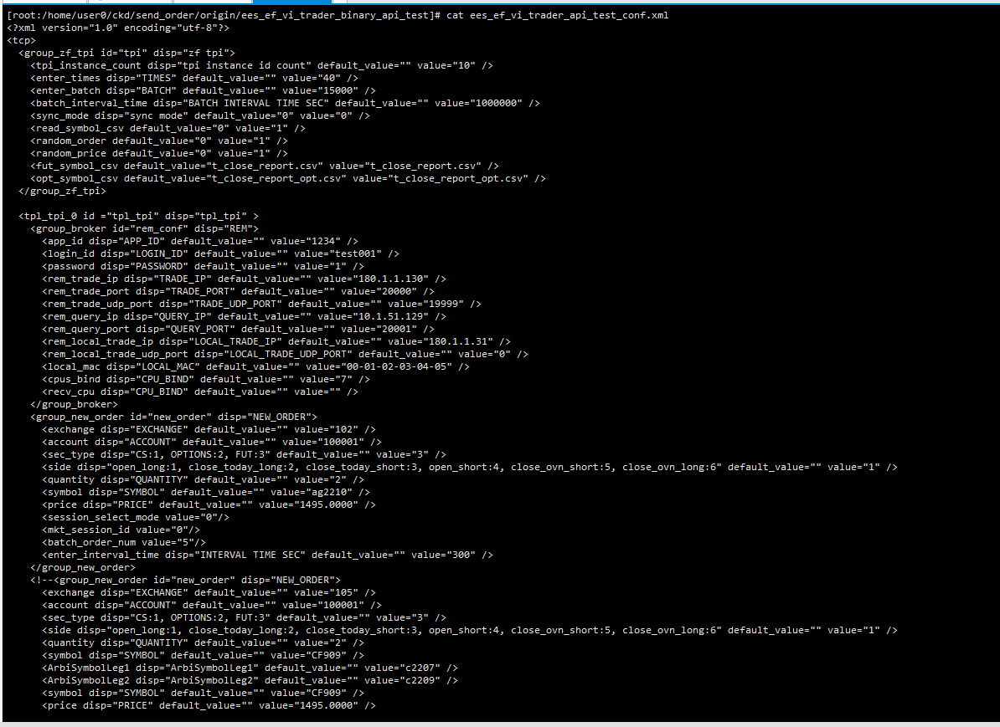
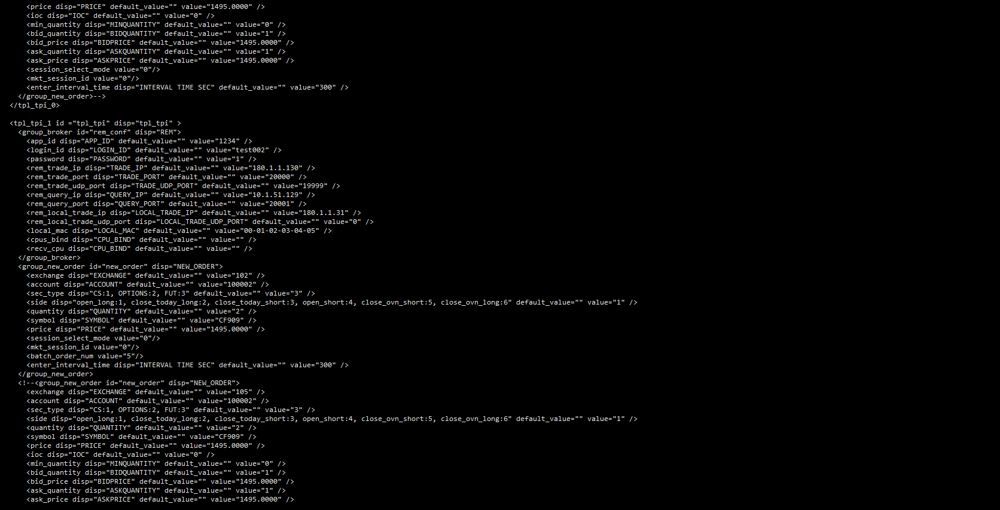
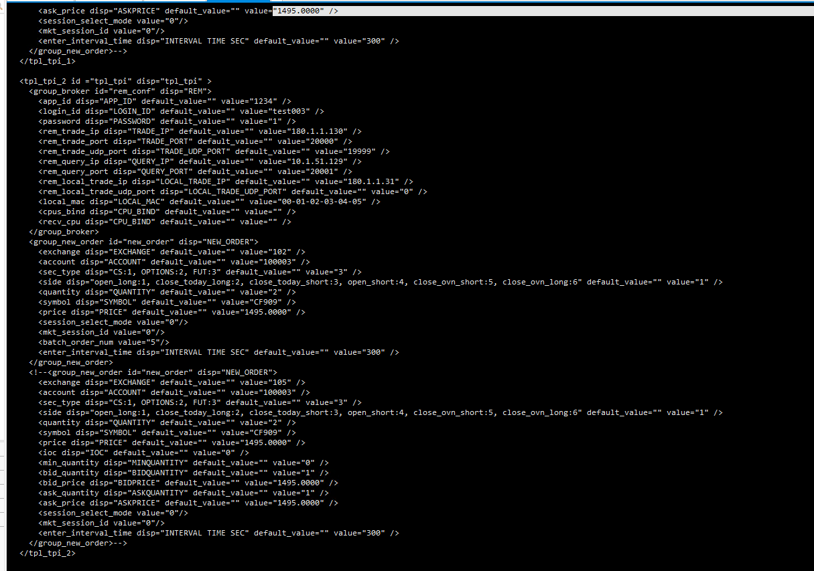
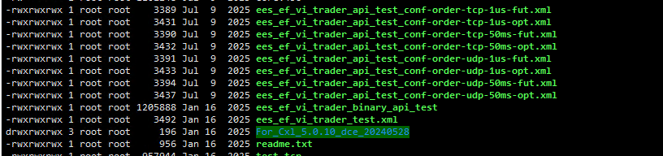

发单工具
在发单工具的根目录下会有一个ees_ef_vi_trader_api_test_conf.xml或者ees_zf_trader_api_test_conf.xml（根据发单工具的不同）
启动发单工具的指令是 ./ees_ef_vi_trader_binary_api_test ees_ef_vi_trader_api_test_conf.xml，指根据xml中的参数来启动工具。
xml中的内容大致为：

需要支持在发单工具的操作台中有一个功能就是可以增删改查这个xml中的内容，因为会有多种测试场景，所以需要存在多个xml配置文件，

所以写一个功能支持这个列表，需要解析xml中的内容，进行更方便的新增和修改。