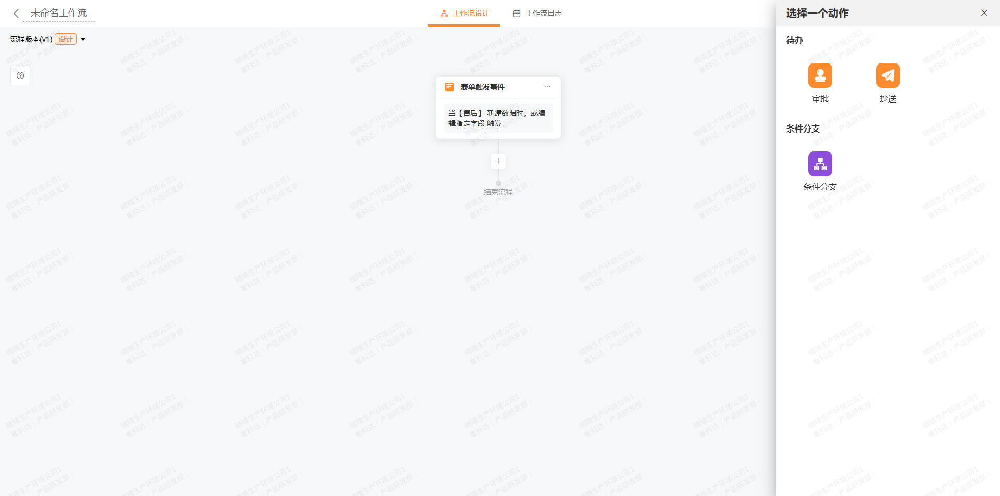
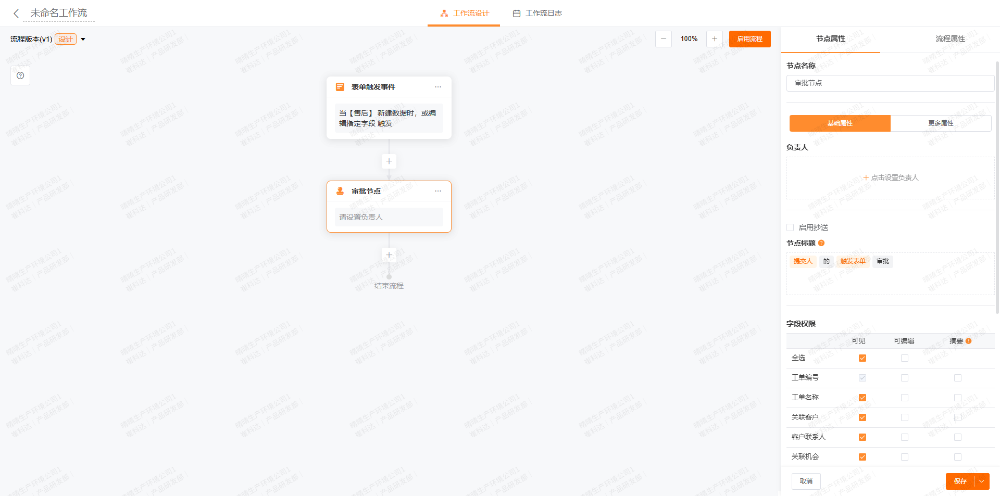
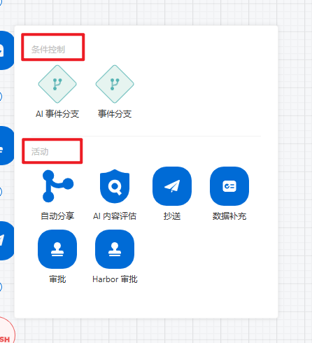
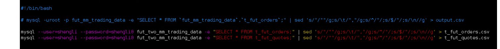
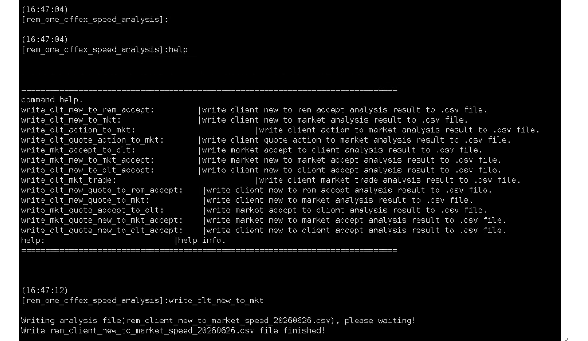

新增场景后需要跳转到一个工作流设置的界面进行工作流的配置。类似于图片
然后有几个节点用户可以手动添加，支持添加到主流程中
    测速流程
    1. 获取配置
    - 1. 获取测试服务器的基本软硬件配置情况（举例，具体用命令行去获取结果）
        选中后展示需要获取基本情况的服务器，具体需要获取的配置进行打勾勾选确定
        a. rem系统服务器：
            1. ip地址
            2. 网卡型号：Exablaze ExaNIC X25 *2
            3. 机器型号：ATZ-308/ACE Z690 UNIFY(MS-7D28)
            4. 操作系统版本：Red Hat Enterprise Linux Server release 7.9(Maipo)
            5. CPU型号：13th Gen Intel(R) Core(TM) i9-13900KS 5.8主频
        b. 模拟市场服务器：
            1. ip地址
            2. 操作系统版本：CentOS Linux release 7.6.1810
            3. CPU型号：Intel(R) Core(TM) i9-7980XE CPU@2.60GHz 16核
        c. 发单工具：
            1. ip地址
            2. 操作系统版本：Red Hat Enterprise Linux Server release 7.9(Maipo)
            3. CPU型号：Intel(R) Xeon(R) Gold 6244 CPU@3.60GHz 16核
        获取后将得到的结果展示并保存(怎么存到数据库中？表的设计你自己思考一下)
    - 2. 获取数据库配置信息
        一般所需要用到的配置项在*_config的数据库的t_global_settings的表中
        选中后展示需要获取配置信息，具体需要获取的配置进行打勾勾选确定
        a. CLIENT_REQ_BIND_CPU
        b. MARKET_RESP_BIND_CPU
        c. RINGBUFFER_RSP_BIND_CPU
        d. TCP_SERVER_BIND_CPU
        e. CLIENT_REQ_ENABLE
        f. CLIENT_REQ_USING_DEV
        g. MARKET_RESP_ENABLE
        h. MARKET_RESQ_DEV
        i. REM_TO_MKT_MESSAGE_DROPCOPY_ENABLE
        j. CLIENT_TO_REM_MESSAGE_DROPCOPY_ENABLE
        k. MARKET_SESSION_IDLE_REPROT_LOG
        l. ACCOUNT_QUANTITY
        m. WARM_ORDER_REPORT_USEC
        n. ENABLE_PERF_COUNTER
        o. ENABLE_RINGBUFFER_RSP
        p. ENABLE_RINGBUFFER_REQ
        q. ASYNC_MKT_MSG_PROC
        r. USER_TOKEN_CANCEL_ENABLE
        s. CLIENT_OT_CONNECT_MODE
        t. EXANIC_IP_FILTER_FLAG
        u. ENABLE_REPORT_TIMESTAMP
        v. X25_KEY_VALUE
        获取后将得到的结果展示并保存(怎么存到数据库中？表的设计你自己思考一下)
    2. 接线
        具体的先不设计，先有这个节点，该节点的功能就是展示一个接线图，让机房工作人员确认接线，点击确认后即可进行下一个流程
    3. 发单
        1. xml配置
            单选 必填
        2. 网卡接口
            单行文本输入框
            实际作用就是在发单工具linux中输入 export ZF_ATTR=interface=p4p1 
        3. 合约数据
            拉下选择.csv文件，可多选
            选中1的xml的文件之后，解析xml中的内容，如果 read_symbol_csv =1的话，需要获取最新的交易日的数据。在发单工具的根目录下有期货合约/期权合约的csv数据，如果没有的话提供按钮，获取数据
            获取数据：从上一步选中的数据库中的*_trading_data中获取，
                期货合约 SELECT * FROM t_close_report WHERE quoto_data = (select max(quote_date) from t_close_report);
                期权合约 SELECT * FROM t_close_report_opt WHERE quoto_data = (select max(quote_date) from t_close_report_opt)
            保存为csv数据，可供选中并展示大概的内容（有几条数据，quote_date是几号）。
     先这些吧，后面的我之后再写
    需要有一个节点大类标题的这种概念，
    比如获取配置节点是标题，只是大的一类，就展示这个名称，也无法选中这个节点，获取服务器配置和获取数据库配置就是两个子节点，获取服务器配置中可以再选择rem系统服务器、模拟市场服务器、发单工具服务器这些。
     4. SLNIC 
        节点
            a. 启动slnic节点
                调用 路径/tcpdump/start_slnic_dump.sh 进行抓包
            b. 关闭slnic节点
                调用 路径/tcpdump/stop_slnic_dump.sh 结束抓包
            c. 合并pcapng节点
                抓包结束后会在/tcpdump目录中生成四个.pcapng的文件，通过调用./pcap_mergetoo slnic* 的命令合并为单一文件merge_pacp.pcap
                然后调用 ./editcap merge_pcap.pcap merge_pcap.pcapng 将.pcap文件转换成.pcapng文件

    资源管理中新增资源添加一个解析工具
        也是跟其他一样 是连接linux的服务器的，类型分为以下几种 
        软核做市
            soft_cffex_speed_analysis
            soft_cffex_speed_analysis_v2
            soft_shfe_speed_analysis_v2
            soft_czce_speed_analysis
            soft_dce_speed_analysis_v7
            soft_gfex_speed_analysis
        整合版二期（NF11）
            hwcffex_1414_2.0
            hwshfe_1414_2.0
        整合版二期做市（MG11）
            mg11
        默认路径为/home/user0/soft_cffex_speed_analvsis这种（根据类型区分）

        解析工具也有操作台，复用现有逻辑可以参考发单工具的，他的目录下也需要有几个xml文件，以soft_cffex_speed_analysis_v2为例
            1. config.xml 默认账户100001
                <?xml version="1.0" encoding="utf-8"?>
                <root>
                    <accounts>
                        <account name="100001" idx="1"/>
                    </accounts>
                </root>
            2. instance.xml 配置席位号与连接实例号
                <?xml version="1.0" encoding="utf-8"?>
                <root>
                    <instance>
                        <instance user_id="222201" idx="141"/>
                    </instance>
                </root>
            3. soft_cffex_speed_analysis.xml
                quoto_file_name -> 指定抓包文件名
                rem_client_ip -> 指定发单客户端ip
                market_ip -> 指定市场ip
                
    
    流程中也加一个数据解析节点
    
    达到该节点时，需要从数据库中获取订单表t_fut_orders.csv/t_fut_quotos.csv/t_fut_arbi_orders.csv到解析工具路径下，同时将抓包获得的merge_pcap.pcapng也放到该解析工具路径下，然后执行./soft_cffex_speed_analysis_v2 soft_cffex_speed_analysis.xml
    工具功能参考image
    write_clt_new_to_mkt           → 普通单/套利单，下单上行
    write_clt_action_to_mkt        → 普通单/套利单，撤单上行
    write_clt_quote_action_to_mkt  → 报价单，撤单上行
    write_mkt_accept_to_clt        → 普通单/套利单，下单下行
    write_clt_new_quote_to_mkt     → 套利单，下单上行
    write_mkt_quote_accept_to_clt  → 套利单，下单下行
    成功解析之后会得到csv文件